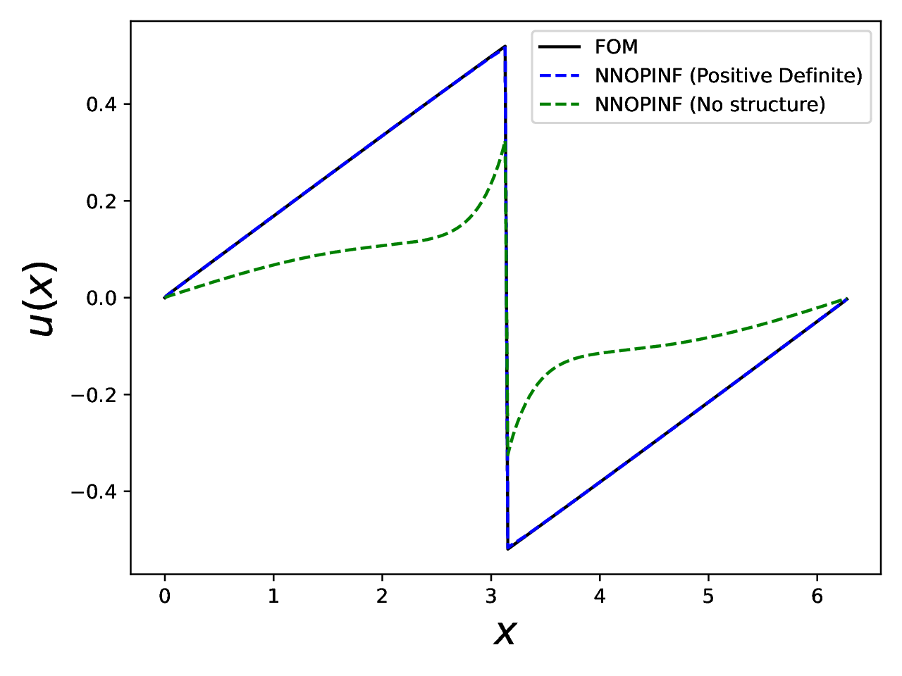

.. pydata-sphinx-theme::

Examples
=============

The repository includes end-to-end scripts in `examples/` that generate training
data, fit NN-OpInf models, and compare reduced-order predictions against
full-order solutions.

Burgers example
---------------

This example builds a reduced-order model for 1D Burgers' equation, trains a
structure-preserving NN-OpInf model, and compares it against a baseline
unstructured model.

Run it:

.. code-block:: bash

   python examples/burgers/burgers_end_to_end.py

Key outputs:

- Plot: `examples/burgers/burgers_solution.pdf`
- Trained models: `examples/burgers/ml-models/`

Code
----

.. literalinclude:: ../../examples/burgers/burgers_end_to_end.py
   :language: python

Walkthrough
-----------

1) **Generate full-order snapshots.** The script solves Burgers' equation with
   a finite-volume upwind flux and RK4 time stepping, storing state snapshots
   over time.
2) **Build a reduced basis.** It performs an SVD on the snapshots and truncates
   to retain almost all energy, yielding a low-dimensional basis ``Phi``.
3) **Project to reduced coordinates.** It projects snapshots into the reduced
   space and estimates time derivatives with centered differences.
4) **Define NN-OpInf operators.** It constructs a positive-definite operator
   and a skew-symmetric operator to enforce energy structure, then wraps them
   into a model.
5) **Train the model.** It normalizes data, optimizes network weights, and
   saves the trained operators and the composite model.
6) **Baseline comparison.** It trains a standard (unstructured) operator model
   on the same data.
7) **Evaluate and plot.** It integrates the learned ROMs forward in time and
   compares the final state against the full-order model.

Final plot
----------

   Burgers' equation: full-order solution vs. NN-OpInf ROMs at the final time.

Tips
----

- The script uses a long training horizon. For a quick smoke test, lower
  ``num-epochs`` and increase ``batch-size`` near the top of the script.
- Output PDFs are written in the example directory.

Transient heat diffusion example
--------------------------------

This example solves transient heat diffusion on the unit square with zero
Dirichlet boundaries and constant forcing, builds a POD-reduced state, and
trains a **linear** structure-preserving NN-OpInf model with:

- ``LinearAffineSpdTensorOperator(acts_on=x, depends_on=(), positive=False)``
  for dissipative diffusion dynamics
- ``VectorOffsetOperator`` for the constant forcing term

Training uses ADAM with LBFGS acceleration:
(``training_settings["optimizer"] = "ADAM"``,
``training_settings["LBFGS-acceleration"] = True``).

Run it:

.. code-block:: bash

   python examples/diffusion/heat_diffusion_end_to_end.py --kappa 0.75 --forcing 1.0

Key outputs:

- Plot: ``examples/diffusion/heat_diffusion_solution.pdf``
- Trained models: ``examples/diffusion/ml-models/``

Code
----

.. literalinclude:: ../../examples/diffusion/heat_diffusion_end_to_end.py
   :language: python
