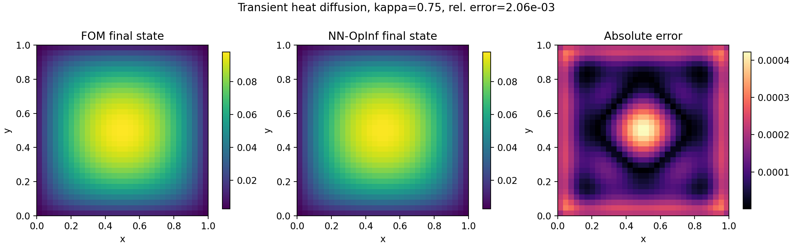

.. pydata-sphinx-theme::

Transient Heat Diffusion Example
================================

This example solves transient heat diffusion on the unit square with zero
Dirichlet boundaries and constant forcing, builds a POD-reduced state, and
trains a **linear** structure-preserving NN-OpInf model with:

- ``LinearAffineSpdTensorOperator(acts_on=x, depends_on=(), positive=False)``
  for dissipative diffusion dynamics.
- ``VectorOffsetOperator`` for the constant forcing term.

Training uses ADAM with LBFGS acceleration:
(``training_settings["optimizer"] = "ADAM"``,
``training_settings["LBFGS-acceleration"] = True``).

Run it:

.. code-block:: bash

   python examples/diffusion/heat_diffusion_end_to_end.py --kappa 0.75 --forcing 1.0

Key outputs:

- Plot: ``examples/diffusion/heat_diffusion_solution.pdf``
- Trained models: ``examples/diffusion/ml-models/``

Code
----

.. literalinclude:: ../../examples/diffusion/heat_diffusion_end_to_end.py
   :language: python

Final plot
----------

   Transient heat diffusion on the unit square: final-state comparison and absolute error.
